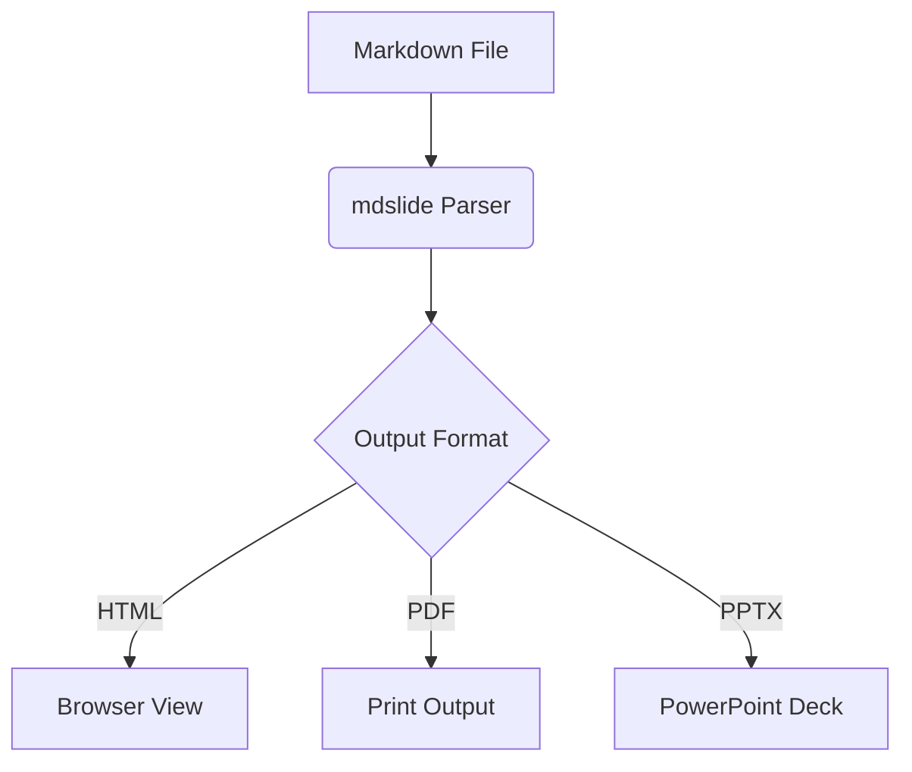

# Advanced Formatting

### KaTeX Equations, GFM Checklists, and Mermaid Flowcharts

---

## Mathematical Equations (KaTeX)

You can display inline equations, like $E = mc^2$, or centered block equations:

$$
f(x) = \int_{-\infty}^{\infty} e^{-x^2} dx
$$

$$
A = \begin{pmatrix} a & b \\ c & d \end{pmatrix}
$$

---

## Mermaid Flowchart Diagrams

---

## GitHub Flavored Markdown (GFM)

Here is a checklist of features you can use:

- [x] Checkboxes and task lists
- [x] ~~Strikethrough~~ text representation
- [x] Centralized tables
- [ ] Auto-wrapping list items
