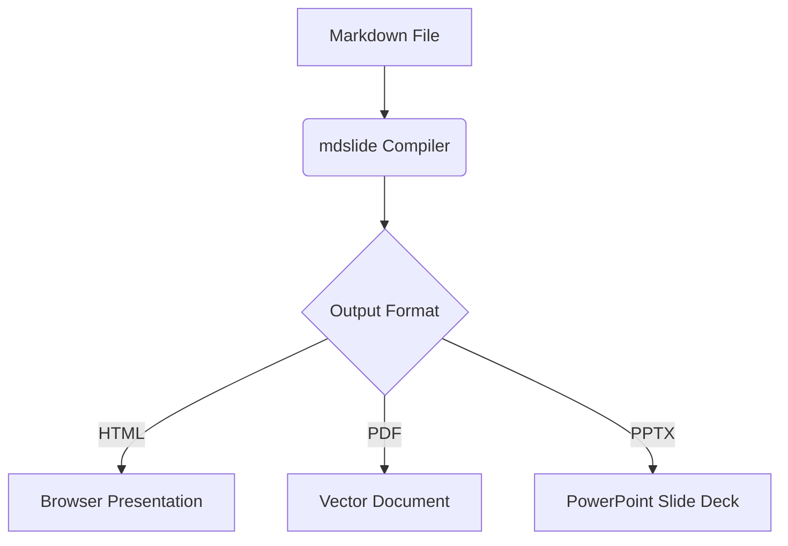

# Advanced Formatting (Math, Diagrams, GFM)

`mdslide` compiles advanced content elements like mathematical equations, structural diagrams, and GitHub Flavored Markdown (GFM) grids right out of the box.

---

## 1. Mathematical Equations (KaTeX)

You can write mathematical equations using LaTeX notation. The compiler uses KaTeX to render them into beautiful vector math layouts.

### Inline Math

Wrap LaTeX syntax in single dollar signs `$`:

```markdown
The Pythagorean theorem is $a^2 + b^2 = c^2$.
```

### Block Math

Wrap LaTeX syntax in double dollar signs `$$` on separate lines to render centered equations:

```latex
$$
f(x) = \int_{-\infty}^{\infty} e^{-x^2} dx
$$
```

---

## 2. Structural Diagrams (Mermaid)

You can draw flowcharts, state diagrams, sequence charts, and Gantt timelines directly inside your slides using `mermaid` fenced code blocks.

### Example Flowchart:

````markdown

````

---

## 3. GitHub Flavored Markdown (GFM)

Standard Markdown only supports basic lists and text blocks. `mdslide` includes full GFM support for creating rich tables, strikethrough text, and interactive task lists:

### Tables

Design styled data grids:

```markdown
| Feature     |  HTML  |  PDF   |       PPTX       |
| :---------- | :----: | :----: | :--------------: |
| Hot Reload  | ✅ Yes | ❌ No  |      ❌ No       |
| Offline Use | ✅ Yes | ✅ Yes |      ✅ Yes      |
| Vector Text | ✅ Yes | ✅ Yes | ⚠️ Editable Mode |
```

### Task Lists

Create checklist checkboxes:

```markdown
- [x] Integrate KaTeX parser
- [x] Configure Docusaurus site
- [ ] Add slide transitions
```

### Strikethrough

Cross out text:

```markdown
This feature is ~~deprecated~~ fully optimized in v1.0.
```
