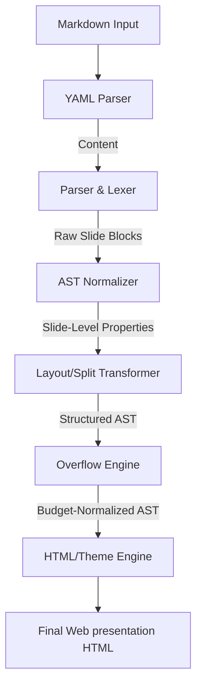

# @mindfiredigital/mdslide-core

The core compilation, normalization, and rendering engine for `mdslide`. It orchestrates the transformation of a parsed Markdown AST into interactive, styled slide decks.

## Compiler Architecture & Pipeline Flow

The compilation process is managed by the central `Compiler` class and flows through the following pipeline:



---

## Key Core Modules

### 1. Parser & Lexer (`src/parser/`)

Translates raw Markdown source string into slide chunks. Slicing boundaries are detected using a three-phase boundary resolution model:

- **Phase 1 (Explicit Dividers)**: Identifies thematic breaks (`---`) or level-2 headings (`##`) to split slides.
- **Phase 2 (Heading Boundaries)**: If no explicit dividers exist, it splits the document at every major header level H1 (`#`) or H3 (`###`).
- **Phase 3 (Fallback Budget Chunking)**: If the document is flat text with no headers or dividers, it accumulates node layout weights until it crosses `MAX_SLIDE_SCORE` (100) and splits to maintain legibility.

### 2. Normalizer & Metadata Extractor (`src/normalizer/`)

Translates standard MDAST nodes into custom Slide AST representations. It parses and filters slide configurations declared in HTML comments:

- **Layout Overrides**: `<!-- layout: type -->` overrides layout classification (`title`, `bullets`, `code`, `visual`, `table`, `quote`, `statement`, `split`).
- **Background Images**: `<!-- backgroundImage: url('...') [dark|light] -->` mounts custom backgrounds.
- **Title Positioning**: `<!-- titleAlign: center -->` (horizontal alignment) and `<!-- titlePosition: bottom -->` (vertical alignment) are normalized and appended to slide data attributes.
- **Speaker Notes**: Text inside `<!-- notes -->...<!-- /notes -->` is extracted as slide notes.

### 3. Layout & Column Transformer (`src/transformers/`)

Handles advanced multi-column transformations:

- **Manual Splits (`::split::`)**: Locates the `::split::` separator block, groups nodes on the left and right, wraps them in column sub-containers, and applies the `split` layout.
- **Auto-Splits**: If a slide contains exactly one image alongside text, the engine automatically splits them into a two-column layout (text on left, image on right). If a slide contains only an image, it transforms it to a full-screen `visual` layout.

### 4. Visual Overflow Engine (`src/overflow/`)

To prevent contents from bleeding out of the viewport, the overflow engine calculates the vertical size of each node in pixels:

- **Height Heuristics**:
  - Code Block: `50px` header + `24px * number of lines`.
  - Table: `35px` header + `38px * number of rows`.
  - Bullet List Item: text wrapping count (evaluated at 55 chars per line) \* `30px` + `10px` margin.
  - Image: `350px`.
  - Paragraph: text wrap count (at 65 chars/line) \* `30px` + `15px`.
  - Headings: H1: wrap count _ `65px` + `20px`; H2/H3: wrap count _ `45px` + `15px`.
- **Splitting Rules**: If the total height exceeds `680px`, it splits lists and code blocks. Remaining items are pushed onto a new continuation slide, retaining the parent settings and appending `(Cont.)` to the title.

### 5. Theme Engine (`src/themes/`)

Injects styling systems:

- Resolves base styles (like 1080p slide margins, transitions, and docks) and integrates custom CSS variables for predefined themes (`light`, `dark`, `notion`, `terminal`, `gradient`, `corporate`, `solarized`).

---

## Slide Syntax & Layout Customization

`mdslide` compiles standard Markdown files. You control structure, layout, typography, animations, and overflow behaviors using YAML frontmatter (for global defaults) and HTML comment annotations (for slide-specific overrides).

### 1. Settings Inheritance & Overrides

Settings can be defined both globally and locally:

- **Global Defaults**: Defined at the very top of your presentation file using YAML frontmatter. These settings apply to all slides.
- **Slide-Specific Overrides**: Declared inside individual slides using HTML comment annotations. When a slide-specific setting is present, it **overrides the global default** for that slide only.

---

### 2. Slide Separation

- **Manual Separation**: Add `---` on a blank line to start a new slide.
- **Automatic Separation**: Level-2 headings (`##`) automatically start a new slide unless manual separators are preferred.

---

### 3. Layout Comments & Overrides

You can manually force a specific layout style on any slide using an HTML comment:

- `<!-- layout: title -->` (Main title layout)
- `<!-- layout: bullets -->` (Bumps font size and styles lists nicely)
- `<!-- layout: code -->` (Full-width preformatted syntax highlighted code block)
- `<!-- layout: visual -->` (Displays images prominently)
- `<!-- layout: quote -->` (Stylized blockquote focus)
- `<!-- layout: table -->` (Formats tables centrally)
- `<!-- layout: statement -->` (Giant centered message layout)
- `<!-- layout: split -->` (Multi-column content structure layout)

---

### 4. Advanced Layouts & Column Splitting

#### **Manual Column Split (`::split::`)**

To split a slide into two equal side-by-side columns:

```markdown
# Columns Layout

Left Column contents.

- Item A
- Item B

::split::

Right Column contents.

- Item C
- Item D
```

#### **Automatic Split Detection**

If a slide contains exactly one image and text block, `mdslide` automatically generates a split layout with the text on one side and the image on the other. If the slide contains only a single image, it renders as a full-screen image cover slide.

---

### 5. Slide Title Alignments & Positions

Override default alignments for any slide's title block:

- `<!-- titleAlign: center -->` — Horizontal alignment: `left` | `center` | `right`
- `<!-- titlePosition: bottom -->` — Vertical position: `top` | `center` | `bottom`

---

### 6. Dynamic Background Images & Smart Contrast

To apply a background image to an individual slide:

```markdown
<!-- backgroundImage: url('https://example.com/image.jpg') -->
```

- **Smart Contrast Detection**: `mdslide` evaluates the image on render. If the background image is dark, slide text flips to light; if the background is light, text shifts to dark gray.
- **Forced Override**: Force a theme contrast by adding `dark` or `light` inside the comment:
  ```markdown
  <!-- backgroundImage: url('image.jpg') dark -->
  ```

---

### 7. Speaker Notes (Presenter View)

Wrap notes inside comment blocks anywhere on a slide. These will be visible in the synced Presenter console window during delivery:

```markdown
<!-- notes -->

Here are my speaker notes for this slide.

<!-- /notes -->
```

---

### 8. Mathematical Equations, GFM & Mermaid Diagrams

`mdslide` includes full support for GitHub Flavored Markdown (GFM), math formatting, and diagramming out of the box:

- **Mathematical Equations (KaTeX)**:
  - **Inline Math**: Wrap LaTeX formulas in single dollar signs `$`, e.g., `$E = mc^2$`.
  - **Block Math**: Wrap formulas in double dollar signs `$$` for centered display math:
    ```latex
    $$
    f(x) = \int_{-\infty}^{\infty} e^{-x^2} dx
    $$
    ```
- **Mermaid Diagrams**:
  - Render flowcharts, sequence diagrams, and class diagrams directly on slides using `mermaid` fenced code blocks:

    ````markdown
    ```mermaid
    graph TD
        A[Start] --> B(Process)
        B --> C{Decision}
        C -->|Yes| D[Success]
        C -->|No| E[Fail]
    ```
    ````

    ```

    ```

- **GitHub Flavored Markdown (GFM)**:
  - **Tables**: Design aligned comparison and data tables.
  - **Task Lists**: Create checkboxes with `- [ ]` and `- [x]`.
  - **Strikethrough**: Cross out text using `~~strikethrough~~`.

---

### 9. Custom Typography, Colors & CSS Overrides

Customize the theme styling using standard CSS variables inside a `<style>` block:

| CSS Variable                | Category       | Description / Default Value                                                   |
| :-------------------------- | :------------- | :---------------------------------------------------------------------------- |
| `--slide-font`              | **Typography** | Main font family for headings, lists, paragraphs, and cards.                  |
| `--slide-mono`              | **Typography** | Font family for inline code and code blocks.                                  |
| `--title-size`              | **Typography** | Font size for slide titles (default: `3.6rem`).                               |
| `--h2-size` / `--h3-size`   | **Typography** | Font sizes for content headings (default: `2.6rem` / `1.8rem`).               |
| `--body-size` / `--li-size` | **Typography** | Font sizes for paragraph text and list items (default: `1.35rem` / `1.3rem`). |
| `--code-size`               | **Typography** | Font size inside code blocks (default: `1.1rem`).                             |
| `--slide-bg`                | **Colors**     | Slide background color.                                                       |
| `--slide-surface`           | **Colors**     | Card/container background color (for quotes, columns).                        |
| `--slide-text`              | **Colors**     | Main body and heading text color.                                             |
| `--slide-muted`             | **Colors**     | Color for secondary metadata or muted text.                                   |
| `--slide-accent`            | **Colors**     | Accent color used for bullet markers, links, highlights, and borders.         |
| `--slide-border`            | **Colors**     | Color for dividing lines and card borders.                                    |
| `--slide-radius`            | **Styling**    | Border-radius styling for cards, code blocks, and images (default: `6px`).    |

#### **Example Override**

```html
<style>
  /* Import distinct display fonts: Creepster (spooky) and Press Start 2P (8-bit pixel) */
  @import url('https://fonts.googleapis.com/css2?family=Creepster&family=Press+Start+2P&display=swap');

  :root {
    /* Override default fonts */
    --slide-font: 'Creepster', cursive;
    --slide-mono: 'Press Start 2P', monospace;

    /* Customize colors and styling */
    --slide-accent: #ff007f; /* Bright neon pink */
    --slide-text: #111111; /* Dark charcoal */
    --slide-radius: 12px; /* Rounder borders */
  }
</style>
```

---

### 10. Presentation Navigation & Controls

When presenting your compiled HTML slides in the browser, you can use the following keyboard shortcuts and interactive actions:

| Key / Control                | Action         | Description                                                                            |
| :--------------------------- | :------------- | :------------------------------------------------------------------------------------- |
| `Space` or `→` (Right Arrow) | Next           | Advance to the next slide (or reveal the next bullet list item/element).               |
| `←` (Left Arrow)             | Previous       | Return to the previous slide or sequential item.                                       |
| `f` / `F`                    | Fullscreen     | Toggle fullscreen mode.                                                                |
| `p` / `P`                    | Presenter View | Open a synced Presenter View window containing speaker notes and a presentation timer. |

---

## Programmatic Usage

You can invoke the compiler programmatically by importing the `Compiler` class:

```typescript
import { Compiler } from '@mindfiredigital/mdslide-core';

const compiler = new Compiler();
const result = compiler.compile(
  `# Slide 1
Content with Math: $E = mc^2$

<style>
:root {
  --slide-accent: #ff007f;
}
</style>
---
# Slide 2`,
  { theme: 'gradient' }
);

console.log(result.html); // Standalone HTML slide deck with CSS styles injected
console.log(result.slides); // Normalized Slide AST array
console.log(result.meta); // Parsed frontmatter configuration metadata
```
